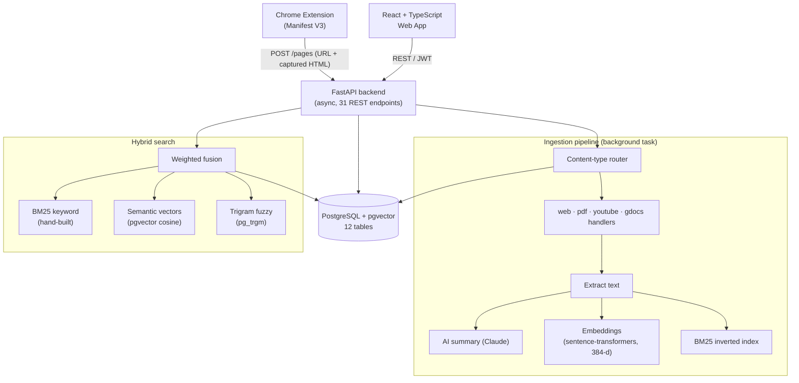

# MyWeb

**Your personal, searchable internet.** Save any webpage, PDF, YouTube video, or Google Doc with one click from a Chrome extension — then search everything you've saved in natural language, powered by a hybrid search engine built from BM25 + semantic vectors + fuzzy matching with no dependency on a hosted search service.

> FastAPI + PostgreSQL/pgvector backend, React/TypeScript frontend, and a Manifest V3 Chrome extension.

---

## What it does

Instead of losing things in browser bookmarks or history, MyWeb turns everything you save into a **personal search engine that understands meaning, not just keywords**. Search *"that article explaining Postgres indexing"* and it finds the right page even if those exact words never appear in it.

### Features
- **One-click saving** from a Chrome extension — captures the live page HTML (so it works on bot-blocked and logged-in pages), or bulk-imports your existing bookmarks.
- **Understands many content types**, each handled specially:
  - **Web articles** → clean text extraction + a saved visual snapshot
  - **PDFs** → downloads and extracts full text; embeds the PDF in the app
  - **YouTube** → embeds the player and indexes the **transcript**, so you can search what was *said*
  - **Google Docs / Sheets / Slides** → embeds the preview; full-text via the Drive API
- **Hybrid natural-language search** — fuses three ranking signals into one relevance score (see below).
- **AI summaries** of every saved page (Claude), generated in a background pipeline.
- **Ask your library** — retrieval-augmented Q&A that answers questions with inline citations from your own saved pages.
- **Organize** — collections, notes, tags, favorites, and auto-computed "related pages."
- **Dashboard** — reading activity over time, top topics, and most-saved sites.
- **Auth** — JWT with email/password **and** Google OAuth, on both the web app and the extension.

---

## Architecture



---

## How the search works

The core of the project is a **hybrid ranker written from scratch** — no Elasticsearch, no hosted search API. A query is scored by three independent signals, normalized, and combined with configurable weights:

| Signal | What it captures | Implementation |
|---|---|---|
| **BM25 keyword** | exact word overlap, weighted by term rarity & document length | hand-built inverted index (`postings` table) + BM25 math in `bm25.py` |
| **Semantic** | *meaning* — matches paraphrases & synonyms | `sentence-transformers` embeddings (384-d) + `pgvector` cosine similarity (HNSW index) |
| **Trigram** | typo/near-miss tolerance on titles | PostgreSQL `pg_trgm` |

The same embeddings power the **Ask** feature: retrieve the top-k relevant pages, then ground a Claude call in them to answer questions with citations.

---

## Tech stack

| Layer | Tech |
|---|---|
| **Backend** | Python, FastAPI (async), SQLAlchemy 2.0 (async), Alembic |
| **Database** | PostgreSQL + **pgvector** (semantic), **pg_trgm** (fuzzy), GIN full-text |
| **AI / NLP** | Claude API, sentence-transformers, spaCy, pypdf, youtube-transcript-api, trafilatura |
| **Frontend** | React, TypeScript, Vite, TailwindCSS, TanStack Query, React Router |
| **Extension** | Chrome Manifest V3, TypeScript, Vite (CRXJS) |
| **Auth** | JWT (access/refresh) + Google OAuth 2.0 |

---

## Repo layout

```
backend/     FastAPI API + async ingestion pipeline + hybrid search
  app/services/   content-type handlers, bm25, embeddings, search, RAG, drive
  app/routers/    auth, pages, search, collections, notes, tags, ask, stats
frontend/    React + TypeScript + Vite web app
extension/   Chrome extension (Manifest V3) — save + bookmark import
```

---

## Running it locally

> Runs locally; no public deployment. Copy `.env.example` to `backend/.env` and
> fill in your own database URL and keys (gitignored). The `/welcome` page
> renders without a backend running.

**Database:** any PostgreSQL 16+ with the `vector` and `pg_trgm` extensions (e.g. a free [Neon](https://neon.tech) project), set as `DATABASE_URL` in `backend/.env`.

**Backend:**
```bash
cd backend
python3 -m venv .venv && source .venv/bin/activate
pip install -e ".[dev]" -e ".[ml]"        # ".[ml]" adds real embeddings/NLP
python -m spacy download en_core_web_sm
alembic upgrade head
uvicorn app.main:app --reload             # http://localhost:8000  (docs at /docs)
```

**Frontend:**
```bash
cd frontend
npm install
npm run dev                                # http://localhost:5173
```

**Extension:** `cd extension && npm run build`, then load `extension/dist` unpacked at `chrome://extensions` (Developer mode on).

Optional keys in `backend/.env` (features are skipped if unset): `ANTHROPIC_API_KEY` (summaries + Ask), `GOOGLE_CLIENT_ID` / `GOOGLE_CLIENT_SECRET` (Google login + Drive).

---

## Roadmap

- [x] Chrome extension: one-click save + live-HTML capture + bookmark import
- [x] Async ingestion pipeline (extract → summarize → embed → index)
- [x] Multi-content-type handlers (web · PDF · YouTube · Google Workspace)
- [x] Hybrid search from scratch (BM25 + pgvector + pg_trgm)
- [x] Web app: search, library, collections, notes, tags, favorites, dashboard
- [x] Retrieval-augmented Q&A over saved pages
- [x] Auth: JWT + Google OAuth (web + extension)
- [ ] Public deployment + CI (GitHub Actions)
- [ ] Move background processing to Celery/Redis for scale
